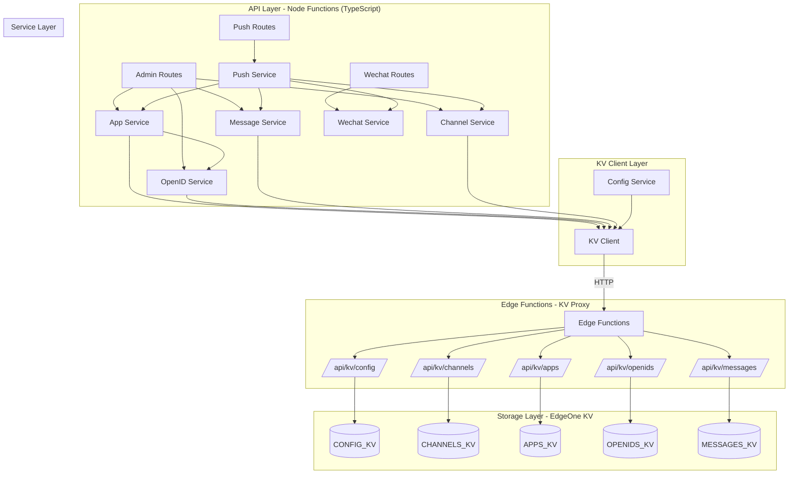

# EdgeOne Webhook Pusher

基于腾讯云 EdgeOne Pages 构建的 Serverless 消息推送服务，支持多渠道推送和订阅群发，采用 Webhook 风格 API。

## 特性

- 🚀 **边缘原生** - 基于 EdgeOne Edge Functions + Node Functions，全球低延迟
- 📱 **微信推送** - 支持微信订阅号模板消息
- 🔑 **多应用管理** - 创建多个应用用于不同推送场景
- 📢 **订阅群发** - 支持单发和订阅模式群发
- 🔗 **Webhook 风格** - 简单 URL 调用：`/{appKey}.send?title=xxx`
- 💾 **KV 存储** - EdgeOne KV 持久化，完全无状态架构
- 🎛️ **Web 控制台** - Nuxt 4 + TDesign + Iconify 管理界面
- 🔒 **安全设计** - 管理 API 需 Token 鉴权，推送 API 通过 App Key 验证
- 🛡️ **TypeScript** - 完整的类型安全，Koa + @koa/router 架构

## 技术架构

### 后端架构 (TypeScript + Koa)

```
node-functions/
├── v1/[[default]].ts          # Koa 应用入口
├── send/[[key]].ts            # Webhook 推送端点
├── types/                     # TypeScript 类型定义
│   ├── index.ts               # 核心实体类型
│   └── context.ts             # Koa Context 扩展
├── routes/                    # 路由层 (@koa/router)
│   ├── init.ts                # 初始化路由
│   ├── config.ts              # 配置管理
│   ├── channels.ts            # 渠道管理
│   ├── apps.ts                # 应用管理
│   ├── openids.ts             # 订阅者管理
│   ├── messages.ts            # 消息历史
│   └── wechat-msg.ts          # 微信消息回调
├── middleware/                # 中间件
│   ├── admin-auth.ts          # 管理员认证
│   ├── error-handler.ts       # 错误处理
│   ├── response-wrapper.ts    # 响应包装
│   └── cors.ts                # CORS 处理
├── services/                  # 业务服务层
│   ├── config.service.ts      # 配置服务
│   ├── channel.service.ts     # 渠道服务
│   ├── app.service.ts         # 应用服务
│   ├── openid.service.ts      # 订阅者服务
│   ├── message.service.ts     # 消息服务
│   ├── push.service.ts        # 推送服务
│   └── wechat.service.ts      # 微信 API 服务
└── shared/                    # 共享工具
    ├── kv-client.ts           # KV 客户端
    ├── utils.ts               # 工具函数
    └── constants.ts           # 常量定义
```

### 系统架构



## 快速开始

### 环境要求

- Node.js 20+
- Yarn 1.22+
- EdgeOne CLI (`npm install -g edgeone`)

### 安装

```bash
git clone https://github.com/ixNieStudio/edgeone-webhook-pusher.git
cd edgeone-webhook-pusher
yarn install
```

### 首次初始化

1. 部署到 EdgeOne Pages
2. 在 EdgeOne 控制台配置 KV 命名空间（见下方 KV 配置）
3. 访问应用，系统检测到未初始化会进入配置页
4. 点击初始化，生成 Admin Token，**请妥善保存**
5. 登录后进入设置页，配置微信公众号凭证

### 本地开发

```bash
# 完整调试（前端 + Node Functions + Edge Functions）
yarn dev:edgeone

# 仅前端开发
yarn dev

# TypeScript 类型检查
yarn typecheck

# 运行测试
yarn test
```

访问 `http://localhost:8088` 进行调试。

**注意**: 本地开发时，需要在 `.env` 中配置 `KV_BASE_URL` 指向已部署的远程服务，以访问 KV 存储：

```env
KV_BASE_URL=https://your-deployed-domain.com
```

### 部署

```bash
yarn build
edgeone pages deploy
```

## KV 存储配置

在 EdgeOne Pages 控制台的「函数」→「KV 存储」中创建以下命名空间，并在「环境变量」中绑定：

| KV 绑定名称 | 用途 | 对应 Edge Function |
|------------|------|-------------------|
| `CONFIG_KV` | 系统配置（adminToken、微信配置等） | `/api/kv/config` |
| `CHANNELS_KV` | 渠道数据（微信公众号配置） | `/api/kv/channels` |
| `APPS_KV` | 应用数据（推送应用配置） | `/api/kv/apps` |
| `OPENIDS_KV` | 订阅者数据（微信 OpenID） | `/api/kv/openids` |
| `MESSAGES_KV` | 消息历史记录 | `/api/kv/messages` |

## 使用方法

### Webhook 推送

```bash
# GET 请求
curl "https://your-domain.com/{appKey}.send?title=服务器告警&desp=CPU使用率超过90%"

# POST 请求
curl -X POST "https://your-domain.com/{appKey}.send" \
  -H "Content-Type: application/json" \
  -d '{"title": "服务器告警", "desp": "CPU使用率超过90%"}'
```

### 响应格式

所有 API 响应统一格式：

```json
{
  "code": 0,
  "message": "success",
  "data": {
    "pushId": "msg_abc123",
    "total": 1,
    "success": 1,
    "failed": 0,
    "results": [
      {
        "openId": "oXXXX_user1",
        "success": true,
        "msgId": "12345678"
      }
    ]
  }
}
```

## API 参考

### 推送 API（通过 App Key 验证）

| 方法 | 路径 | 描述 |
|------|------|------|
| GET/POST | `/{appKey}.send?title=xxx&desp=xxx` | 消息推送 |
| GET/POST | `/send/{appKey}?title=xxx&desp=xxx` | 消息推送（备用路径） |

### 管理 API（需要 Admin Token）

请求头：`X-Admin-Token: your-admin-token` 或 `Authorization: Bearer your-admin-token`

| 方法 | 路径 | 描述 |
|------|------|------|
| GET | `/v1/init/status` | 检查初始化状态 |
| POST | `/v1/init` | 执行初始化 |
| GET | `/v1/config` | 获取系统配置 |
| PUT | `/v1/config` | 更新系统配置 |
| GET/POST | `/v1/channels` | 渠道列表/创建 |
| GET/PUT/DELETE | `/v1/channels/:id` | 渠道 CRUD |
| GET/POST | `/v1/apps` | 应用列表/创建 |
| GET/PUT/DELETE | `/v1/apps/:id` | 应用 CRUD |
| GET/POST | `/v1/apps/:appId/openids` | 订阅者列表/添加 |
| DELETE | `/v1/apps/:appId/openids/:id` | 移除订阅者 |
| GET | `/v1/messages` | 消息历史列表 |
| GET | `/v1/messages/:id` | 消息详情 |

### 微信消息接口（公众号回调）

| 方法 | 路径 | 描述 |
|------|------|------|
| GET | `/v1/wechat` | 微信服务器验证 |
| POST | `/v1/wechat` | 接收公众号消息 |

## 数据模型

### Channel（渠道）

```typescript
interface Channel {
  id: string;           // ch_xxx
  name: string;         // 渠道名称
  type: 'wechat';       // 渠道类型
  config: {
    appId: string;      // 微信 AppID
    appSecret: string;  // 微信 AppSecret
  };
  createdAt: string;
  updatedAt: string;
}
```

### App（应用）

```typescript
interface App {
  id: string;                        // app_xxx
  key: string;                       // APKxxx（用于 Webhook）
  name: string;                      // 应用名称
  channelId: string;                 // 关联渠道
  pushMode: 'single' | 'subscribe';  // 推送模式
  messageType: 'normal' | 'template'; // 消息类型
  templateId?: string;               // 模板 ID
  openIds: string[];                 // 订阅者 OpenID 列表
  createdAt: string;
  updatedAt: string;
}
```

### OpenID（订阅者）

```typescript
interface OpenID {
  id: string;        // oid_xxx
  appId: string;     // 所属应用
  openId: string;    // 微信 OpenID
  nickname?: string; // 昵称
  remark?: string;   // 备注
  createdAt: string;
  updatedAt: string;
}
```

## 项目结构

```
├── app/                          # Nuxt 4 前端应用
│   ├── pages/                    # 页面组件
│   ├── composables/              # 组合式函数
│   ├── stores/                   # Pinia 状态管理
│   └── middleware/               # 路由中间件
├── edge-functions/               # Edge Functions (KV Proxy)
│   └── api/kv/                   # KV 操作代理
├── node-functions/               # Node Functions (TypeScript)
│   ├── v1/[[default]].ts         # Koa 应用入口
│   ├── send/[[key]].ts           # Webhook 端点
│   ├── types/                    # 类型定义
│   ├── routes/                   # 路由层
│   ├── middleware/               # 中间件
│   ├── services/                 # 服务层
│   └── shared/                   # 共享工具
├── public/                       # 静态资源
├── nuxt.config.ts                # Nuxt 配置
├── edgeone.json                  # EdgeOne 配置
└── package.json
```

## 技术栈

- **前端**: Nuxt 4 + Vue 3 + TDesign + Pinia
- **后端**: TypeScript + Koa 3 + @koa/router
- **存储**: EdgeOne KV
- **测试**: Vitest + fast-check
- **部署**: EdgeOne Pages

## 开发命令

```bash
yarn dev           # 启动 Nuxt 开发服务器
yarn dev:edgeone   # 启动 EdgeOne 完整开发环境
yarn build         # 构建生产版本
yarn typecheck     # TypeScript 类型检查
yarn test          # 运行测试
yarn clean         # 清理构建产物
```

## 更新日志

### 2026-01-15

- **TypeScript 迁移完成** - 后端代码全面迁移到 TypeScript
- 使用 Koa + @koa/router 重构路由架构
- 添加完整的类型定义和类型安全
- 优化 KV 客户端，支持开发环境远程 KV 访问
- 修复 Webhook 端点文件名规范（`[[key]].ts`）

### 2026-01-14

- 修复前端管理界面与后端 API 接口不匹配问题
- 添加 EdgeOne CLI 本地调试支持

## 许可证

GPL-3.0

## 作者

colin@ixNieStudio
