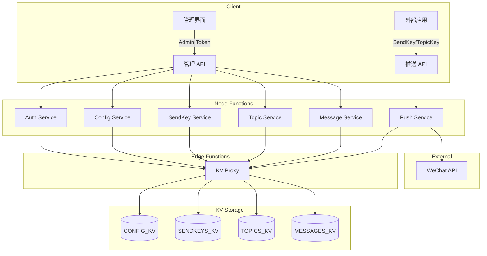

# EdgeOne Webhook Pusher

基于腾讯云 EdgeOne Pages 构建的 Serverless 消息推送服务，支持多 SendKey 单发和 Topic 群发，采用 Webhook 风格 API。

## 特性

- 🚀 **边缘原生** - 基于 EdgeOne Edge Functions + Node Functions，全球低延迟
- 📱 **微信推送** - 支持微信订阅号模板消息
- 🔑 **多 SendKey** - 创建多个 SendKey 用于不同应用场景
- 📢 **Topic 群发** - 创建主题，订阅者接收群发消息
- 🔗 **Webhook 风格** - 简单 URL 调用：`/{sendKey}.send?title=xxx`
- 💾 **KV 存储** - EdgeOne KV 持久化，数据安全可靠
- 🎛️ **Web 控制台** - Nuxt 4 + TDesign 管理界面
- 🔒 **安全设计** - 管理 API 需 Token 鉴权，推送 API 无需鉴权

## 架构



## 快速开始

### 环境要求

- Node.js 22+
- Yarn 1.22+
- EdgeOne CLI (`npm install -g edgeone`)

### 安装

```bash
git clone https://github.com/ixNieStudio/edgeone-webhook-pusher.git
cd edgeone-webhook-pusher
yarn install
```

### 首次初始化

1. 部署到 EdgeOne Pages
2. 访问应用，系统检测到未初始化会进入配置页
3. 生成 Admin Token，**请妥善保存**
4. 配置微信公众号凭证（appId、appSecret、templateId）

### 本地开发

```bash
# 启动开发服务器
yarn dev

# 运行测试
yarn test
```

### 部署

```bash
yarn build
edgeone pages deploy
```

## 使用方法

### 单发推送

```bash
# 使用 SendKey 发送到绑定的微信用户
curl "https://your-domain.com/{sendKey}.send?title=服务器告警&desp=CPU使用率超过90%"
```

### 群发推送

```bash
# 使用 TopicKey 发送到所有订阅者
curl "https://your-domain.com/{topicKey}.topic?title=系统公告&desp=今晚22点维护"
```

### 响应格式

```json
{
  "code": 0,
  "message": "success",
  "data": {
    "pushId": "push_123456",
    "results": [
      {
        "openId": "oXXXX_user1",
        "success": true,
        "msgId": "12345678"
      }
    ]
  }
}
```

## API 参考

### 推送 API（无需鉴权）

| 方法 | 路径 | 描述 |
|------|------|------|
| GET/POST | `/{sendKey}.send?title=xxx&desp=xxx` | 单发推送 |
| GET/POST | `/{topicKey}.topic?title=xxx&desp=xxx` | 群发推送 |

### 管理 API（需要 Admin Token）

| 方法 | 路径 | 描述 |
|------|------|------|
| GET | `/api/init/status` | 检查初始化状态 |
| POST | `/api/init` | 执行初始化 |
| GET | `/api/config` | 获取应用配置 |
| PUT | `/api/config` | 更新应用配置 |
| GET/POST | `/api/openids` | OpenID 管理 |
| GET/POST | `/api/sendkeys` | SendKey 管理 |
| GET/POST | `/api/topics` | Topic 管理 |
| POST | `/api/topics/:id/subscribe` | 添加订阅者 |
| GET | `/api/messages` | 查询消息历史 |

## 数据模型

### SendKey（单发）

每个 SendKey 绑定一个微信 OpenID，用于向特定用户发送消息。

```json
{
  "id": "sk_abc123",
  "key": "SCT1234567890abcdef",
  "name": "服务器监控",
  "openIdRef": "oid_user1"
}
```

### Topic（群发）

每个 Topic 可以有多个订阅者，使用 TopicKey 向所有订阅者广播消息。

```json
{
  "id": "tp_xyz789",
  "key": "TPK9876543210fedcba",
  "name": "系统公告",
  "subscriberRefs": ["oid_user1", "oid_user2"]
}
```

## 项目结构

```
├── app/                      # Nuxt 4 应用
│   ├── composables/
│   ├── layouts/
│   └── pages/
├── edge-functions/           # Edge Functions (KV Proxy)
│   └── api/kv/
├── node-functions/           # Node Functions
│   ├── middleware/           # 中间件（鉴权、限流）
│   ├── routes/               # 管理 API 路由
│   ├── send/                 # 单发推送路由
│   ├── topic/                # 群发推送路由
│   ├── services/             # 业务服务
│   └── shared/               # 共享工具
├── tests/                    # 测试文件
├── nuxt.config.ts
├── edgeone.json
└── package.json
```

## KV 存储配置

在 EdgeOne Pages 控制台创建以下 KV 命名空间：

| KV 绑定名称 | 用途 |
|-------------|------|
| `CONFIG_KV` | 应用配置（Admin Token、微信凭证） |
| `SENDKEYS_KV` | SendKey 数据 |
| `TOPICS_KV` | Topic 数据 |
| `OPENIDS_KV` | OpenID 数据 |
| `MESSAGES_KV` | 消息历史 |

## 技术栈

- **框架**: Nuxt 4 + Koa 3
- **UI**: TDesign Vue Next
- **持久化**: EdgeOne KV
- **测试**: Vitest + fast-check
- **包管理**: Yarn

## 许可证

GPL-3.0

## 作者

colin@ixNieStudio
