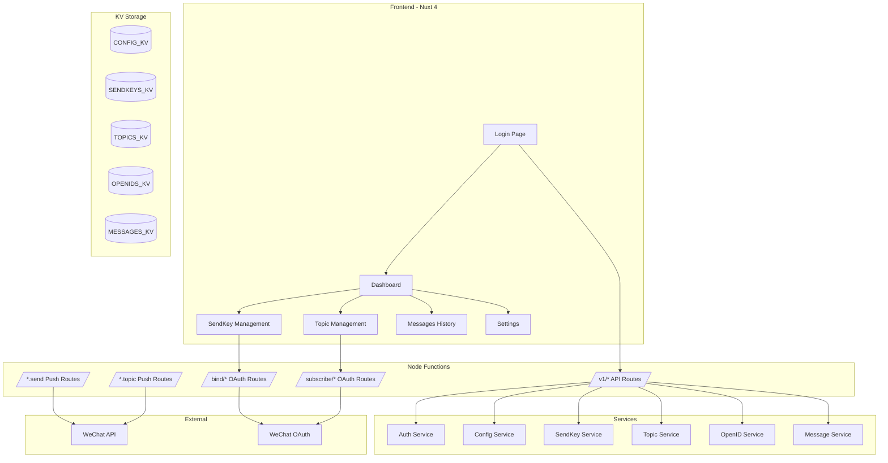

# EdgeOne Webhook Pusher

基于腾讯云 EdgeOne Pages 构建的 Serverless 消息推送服务，支持多 SendKey 单发和 Topic 群发，采用 Webhook 风格 API。

## 特性

- 🚀 **边缘原生** - 基于 EdgeOne Edge Functions + Node Functions，全球低延迟
- 📱 **微信推送** - 支持微信订阅号模板消息
- 🔑 **多 SendKey** - 创建多个 SendKey 用于不同应用场景
- 📢 **Topic 群发** - 创建主题，订阅者接收群发消息
- 🔗 **Webhook 风格** - 简单 URL 调用：`/{sendKey}.send?title=xxx`
- 💾 **KV 存储** - EdgeOne KV 持久化，完全无状态架构
- 🎛️ **Web 控制台** - Nuxt 4 + TDesign + Iconify 管理界面
- 🔒 **安全设计** - 管理 API 需 Token 鉴权，推送 API 无需鉴权
- 📲 **扫码绑定** - 通过微信 OAuth 扫码绑定用户，无需手动输入 OpenID

## 架构



## 业务流程

```
初始化项目 → 配置渠道 → 新建消息应用(SendKey/Topic) → 分配 Key → 绑定用户(扫码/消息) → 发送消息
```

### 绑定方式

支持两种绑定方式：

1. **扫码绑定**：用户扫描 SendKey/Topic 的二维码，通过微信 OAuth 授权完成绑定（需先关注公众号）
2. **消息绑定**：用户在公众号内发送指令完成绑定
   - 绑定 SendKey：发送 `绑定 SCTxxxxx`
   - 订阅 Topic：发送 `订阅 TPKxxxxx`
   - 解绑 SendKey：发送 `解绑 SCTxxxxx`
   - 退订 Topic：发送 `退订 TPKxxxxx`

### SendKey 绑定流程（扫码）

```mermaid
sequenceDiagram
    participant Admin as 管理员
    participant UI as Admin UI
    participant API as Backend
    participant WX as WeChat OAuth
    participant User as 微信用户
    
    Admin->>UI: 创建 SendKey
    UI->>API: POST /v1/sendkeys
    API-->>UI: 返回 SendKey + bindUrl
    UI->>UI: 显示 QR Code
    
    User->>API: 扫码访问 bindUrl
    API->>WX: 重定向到 WeChat OAuth
    User->>WX: 同意授权
    WX->>API: 回调 + code
    API->>WX: 获取 OpenID
    API->>API: 检查关注状态
    alt 未关注
        API-->>User: 提示先关注公众号
    else 已关注
        API->>API: 绑定到 SendKey
        API-->>User: 显示绑定成功
    end
```



### SendKey 绑定流程（消息）

```mermaid
sequenceDiagram
    participant User as 微信用户
    participant WX as 公众号
    participant API as Backend
    
    User->>WX: 发送 "绑定 SCTxxxxx"
    WX->>API: POST /v1/wechat (消息回调)
    API->>API: 解析绑定指令
    API->>API: 查找 SendKey
    alt SendKey 不存在
        API-->>WX: 回复绑定失败
    else SendKey 存在
        API->>API: 创建/获取 OpenID 记录
        API->>API: 绑定到 SendKey
        API-->>WX: 回复绑定成功
    end
    WX-->>User: 显示回复消息
```



## 快速开始

### 环境要求

- Node.js 22+
- Yarn 1.22+
- EdgeOne CLI (`npm install -g edgeone`)

### 安装

```bash
git clone https://github.com/user/edgeone-webhook-pusher.git
cd edgeone-webhook-pusher
yarn install
```

### 首次初始化

1. 部署到 EdgeOne Pages
2. 访问应用，系统检测到未初始化会进入配置页
3. 点击初始化，生成 Admin Token，**请妥善保存**
4. 登录后进入设置页，配置微信公众号凭证（appId、appSecret、templateId）

### 本地开发

```bash
# 启动开发服务器
yarn dev

# 运行测试
yarn test
```

### 部署

```bash
yarn build
edgeone pages deploy
```

## 使用方法

### 单发推送

```bash
# 使用 SendKey 发送到绑定的微信用户
curl "https://your-domain.com/{sendKey}.send?title=服务器告警&desp=CPU使用率超过90%"
```

### 群发推送

```bash
# 使用 TopicKey 发送到所有订阅者
curl "https://your-domain.com/{topicKey}.topic?title=系统公告&desp=今晚22点维护"
```

### 响应格式

```json
{
  "code": 0,
  "message": "success",
  "data": {
    "pushId": "push_123456",
    "results": [
      {
        "openId": "oXXXX_user1",
        "success": true,
        "msgId": "12345678"
      }
    ]
  }
}
```

## API 参考

### 推送 API（无需鉴权）

| 方法 | 路径 | 描述 |
|------|------|------|
| GET/POST | `/{sendKey}.send?title=xxx&desp=xxx` | 单发推送 |
| GET/POST | `/{topicKey}.topic?title=xxx&desp=xxx` | 群发推送 |

### 绑定/订阅 API（无需鉴权，OAuth 流程）

| 方法 | 路径 | 描述 |
|------|------|------|
| GET | `/v1/bind/:sendKeyId` | SendKey 绑定入口，重定向到 WeChat OAuth |
| GET | `/v1/bind/:sendKeyId/callback` | WeChat OAuth 回调，完成绑定 |
| GET | `/v1/subscribe/:topicId` | Topic 订阅入口，重定向到 WeChat OAuth |
| GET | `/v1/subscribe/:topicId/callback` | WeChat OAuth 回调，完成订阅 |

### 微信消息接口（无需鉴权，公众号回调）

| 方法 | 路径 | 描述 |
|------|------|------|
| GET | `/v1/wechat` | 微信服务器验证 |
| POST | `/v1/wechat` | 接收公众号消息（关注事件、绑定指令） |

### 管理 API（需要 Admin Token）

| 方法 | 路径 | 描述 |
|------|------|------|
| GET | `/v1/init/status` | 检查初始化状态 |
| POST | `/v1/init` | 执行初始化 |
| POST | `/v1/auth/validate` | 验证 Admin Token |
| GET | `/v1/stats` | 获取统计数据 |
| GET | `/v1/config` | 获取应用配置 |
| PUT | `/v1/config` | 更新应用配置 |
| GET/POST | `/v1/openids` | OpenID 管理 |
| DELETE | `/v1/openids/:id` | 删除 OpenID（检查引用） |
| GET/POST | `/v1/sendkeys` | SendKey 管理 |
| GET/PUT/DELETE | `/v1/sendkeys/:id` | SendKey CRUD |
| POST | `/v1/sendkeys/:id/unbind` | 解绑 SendKey |
| GET/POST | `/v1/topics` | Topic 管理 |
| GET/PUT/DELETE | `/v1/topics/:id` | Topic CRUD |
| DELETE | `/v1/topics/:id/subscribe/:openIdRef` | 取消订阅 |
| GET | `/v1/messages` | 查询消息历史 |
| GET | `/v1/messages/:id` | 消息详情 |

## 数据模型

### SendKey（单发）

每个 SendKey 绑定一个微信 OpenID，用于向特定用户发送消息。

```json
{
  "id": "sk_abc123",
  "key": "SCT1234567890abcdef",
  "name": "服务器监控",
  "openIdRef": "oid_user1",
  "bindUrl": "https://your-domain.com/v1/bind/sk_abc123"
}
```

### Topic（群发）

每个 Topic 可以有多个订阅者，使用 TopicKey 向所有订阅者广播消息。

```json
{
  "id": "tp_xyz789",
  "key": "TPK9876543210fedcba",
  "name": "系统公告",
  "subscriberRefs": ["oid_user1", "oid_user2"],
  "subscribeUrl": "https://your-domain.com/v1/subscribe/tp_xyz789"
}
```

## 项目结构

```
├── app/                          # Nuxt 4 前端应用
│   ├── app.vue                   # 根组件
│   ├── composables/
│   │   └── useApi.ts             # API 请求封装
│   ├── layouts/
│   │   └── default.vue           # 默认布局（侧边栏导航）
│   ├── middleware/
│   │   └── auth.global.ts        # 全局认证中间件
│   ├── pages/
│   │   ├── index.vue             # Dashboard 仪表盘
│   │   ├── login.vue             # 登录/初始化页面
│   │   ├── messages.vue          # 消息历史
│   │   ├── settings.vue          # 系统设置
│   │   ├── sendkeys/
│   │   │   ├── index.vue         # SendKey 列表
│   │   │   └── [id].vue          # SendKey 详情
│   │   └── topics/
│   │       ├── index.vue         # Topic 列表
│   │       └── [id].vue          # Topic 详情
│   ├── plugins/
│   │   └── tdesign.ts            # TDesign 插件
│   └── stores/
│       └── auth.ts               # 认证状态管理
├── edge-functions/               # Edge Functions
│   └── api/kv/                   # KV Proxy
├── node-functions/               # Node Functions
│   ├── middleware/               # 中间件（鉴权）
│   ├── routes/                   # 管理 API 路由
│   │   ├── init.js               # 初始化
│   │   ├── config.js             # 配置管理
│   │   ├── openids.js            # OpenID 管理
│   │   ├── sendkeys.js           # SendKey 管理
│   │   ├── topics.js             # Topic 管理
│   │   ├── messages.js           # 消息历史
│   │   ├── stats.js              # 统计数据
│   │   ├── bind.js               # SendKey 绑定 OAuth
│   │   └── subscribe.js          # Topic 订阅 OAuth
│   ├── send/                     # 单发推送路由
│   ├── topic/                    # 群发推送路由
│   ├── services/                 # 业务服务
│   ├── shared/                   # 共享工具
│   └── v1/
│       └── [[default]].js        # Koa 路由入口
├── tests/                        # 测试文件
├── public/                       # 静态资源
├── nuxt.config.ts                # Nuxt 配置
├── edgeone.json                  # EdgeOne 配置
├── vitest.config.js              # Vitest 配置
└── package.json
```

## KV 存储配置

在 EdgeOne Pages 控制台创建以下 KV 命名空间：

| KV 绑定名称 | 用途 |
|-------------|------|
| `CONFIG_KV` | 应用配置（Admin Token、微信凭证、OAuth State） |
| `SENDKEYS_KV` | SendKey 数据 |
| `TOPICS_KV` | Topic 数据 |
| `OPENIDS_KV` | OpenID 数据 |
| `MESSAGES_KV` | 消息历史 |

### KV 操作规范

所有 KV 操作严格遵守 EdgeOne 格式：

```javascript
// 正确的 KV 操作方式
await CONFIG_KV.get('config');
await CONFIG_KV.put('config', JSON.stringify(data));
await CONFIG_KV.delete('config');
await CONFIG_KV.list({ prefix: 'sk:' });
```

## 技术栈

- **框架**: Nuxt 4 + Koa 3
- **UI**: TDesign Vue Next
- **图标**: Iconify (@iconify/vue)
- **二维码**: qrcode
- **状态管理**: Pinia
- **持久化**: EdgeOne KV
- **测试**: Vitest + fast-check
- **包管理**: Yarn

## 许可证

GPL-3.0

## 作者

colin@ixNieStudio
